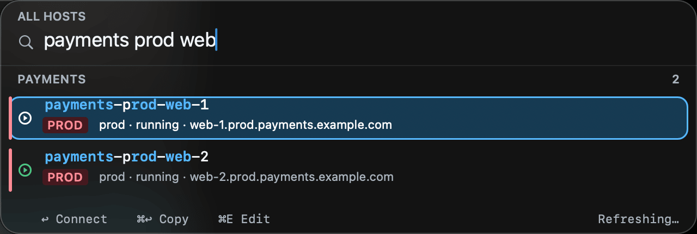
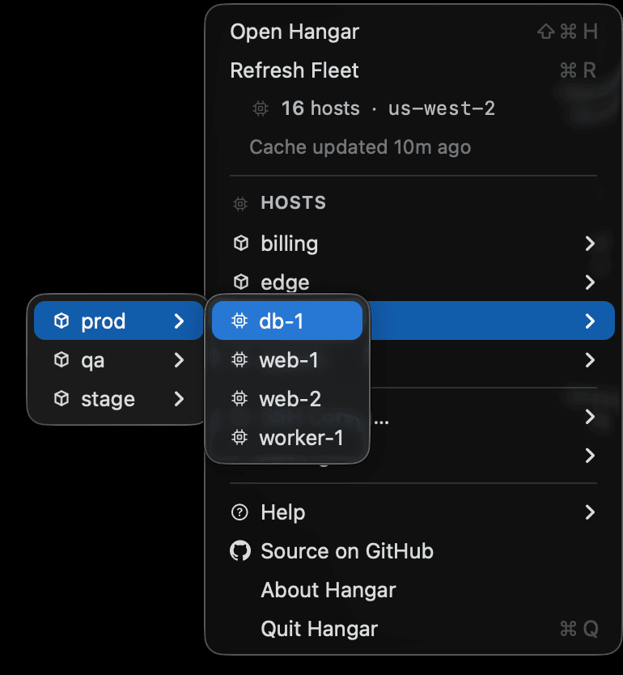
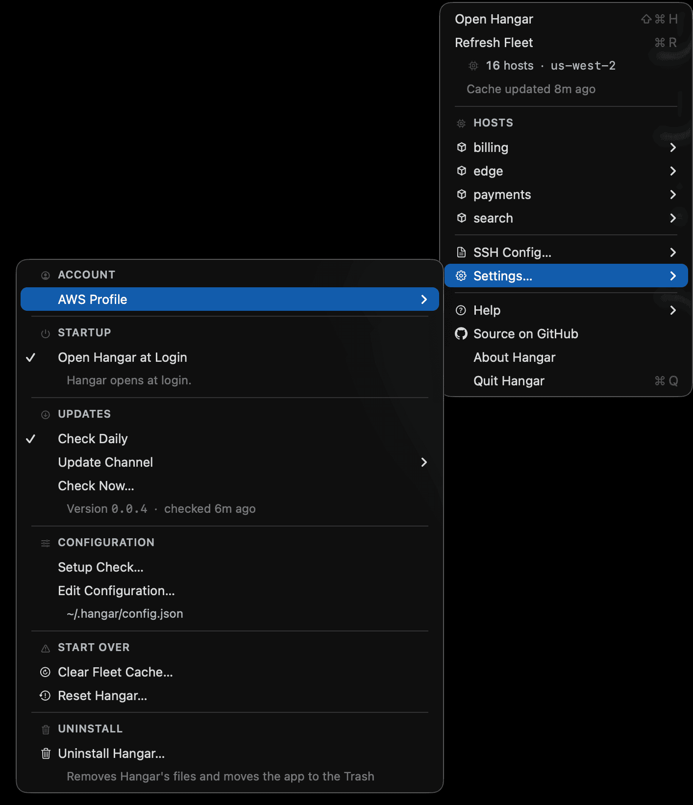
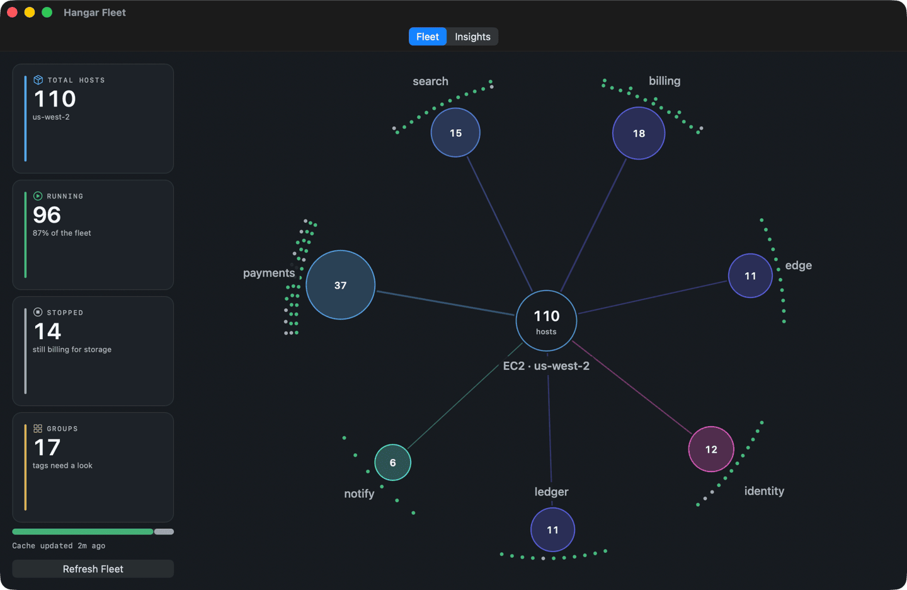
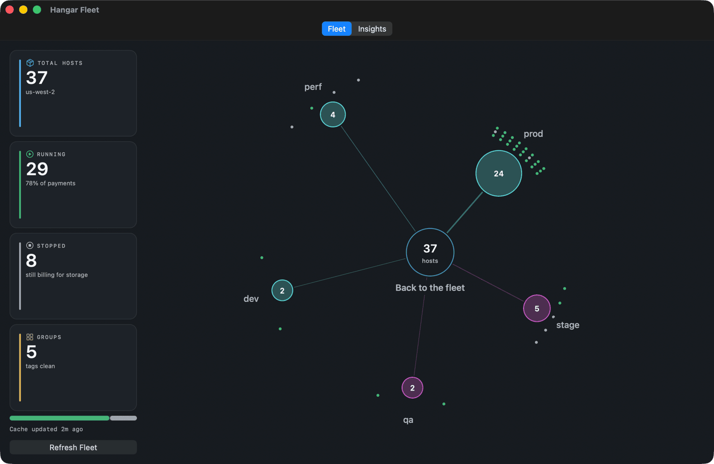
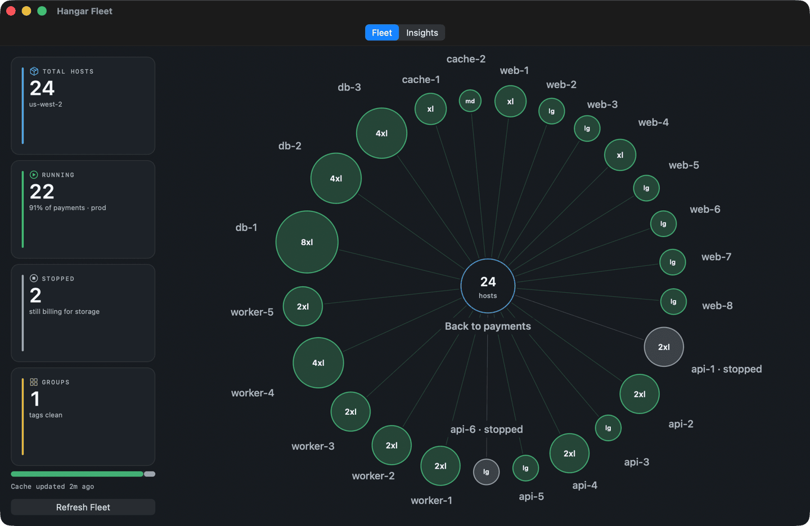
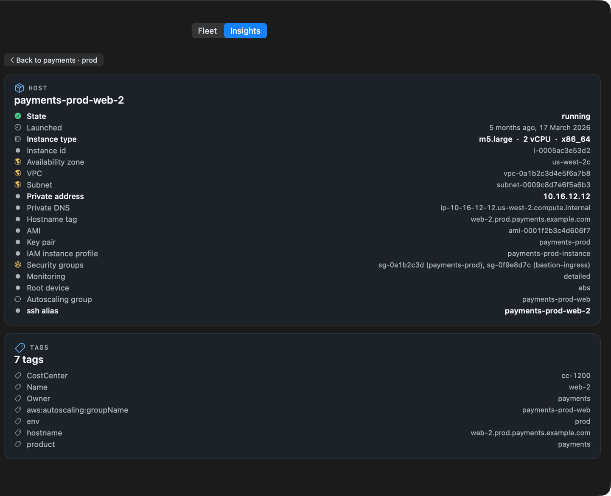
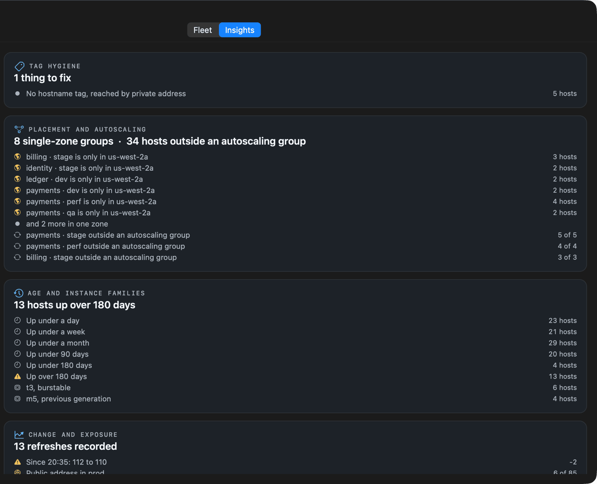

<div align="center">


# Hangar

**Spotlight for your SSH hosts.**

A native macOS launcher that turns changing EC2 instances into stable, searchable
SSH targets.

Press <kbd>⌘</kbd><kbd>⇧</kbd><kbd>H</kbd>, type a few characters, press
<kbd>Return</kbd>, and you are on the box.

### [Download Hangar](https://github.com/goriparthi/hangar/releases/latest)

**[hangar homepage](https://goriparthi.github.io/hangar/)**

Signed and notarized by Apple. Open the DMG, drag Hangar to Applications, launch it.
No Gatekeeper warning, no `xattr` command, no Homebrew, no Xcode.



<sub>The panel, three words in. The fleet in every screenshot here is fictional.</sub>

</div>

---

## Thousands of hosts to the right one

Autoscaling replaces instances and their hostnames go with them. The lookup is
the work, and you do it again every time.

**Without Hangar.** Remember roughly what the box is called. Run
`aws ec2 describe-instances --filters …` and read JSON to find it. Copy a
58-character `ip-10-0-42-17.us-west-2.compute.internal`. `ssh ec2-user@…` and
hope the login is right. Tomorrow the instance is replaced and the hostname you
saved is gone.

**With Hangar.** Press <kbd>⌘</kbd><kbd>⇧</kbd><kbd>H</kbd>. Type
`payments prod web`; terms match in any order. Press <kbd>Return</kbd>; the first
match is already selected. You are on the box, in iTerm2 or Terminal, with the
right login. Tomorrow the alias still works, because it follows the tags rather
than the hostname.

Search stays under half a millisecond per keystroke at ten thousand hosts.

## Built for the way you already work

Standard SSH underneath. Nothing to learn, nothing to migrate.

- **Fuzzy fleet search.** Terms match in any order across alias, hostname and
  tags. Type the three things you remember.
- **Stable SSH aliases.** Hangar owns one `ssh_config` include and rewrites it on
  every sync, so terminated instances drop out on their own. `ssh
  payments-prod-web-1` works from any terminal, and from `scp`, `rsync`, Ansible
  and VS Code Remote.
- **Native terminal launch.** <kbd>Return</kbd> opens a real session in iTerm2 or
  Terminal. <kbd>⌘</kbd><kbd>Return</kbd> copies the command instead.
- **Works with your tags, not ours.** `product`/`env`, `Service`/`Environment`,
  `app`/`stage`, or a single `Name` tag all work with no configuration. The setup
  screen shows the tag keys your fleet actually uses and lets you point each one
  at the right key.
- **Credentials stay local.** The same resolution order the AWS CLI uses, read
  from your home directory. Expired SSO tokens refresh in place.
- **Fix a wrong login in place.** <kbd>⌘</kbd>-click a host to set its ssh user
  or key, with a **Detect Login** button that probes the usual cloud-image logins
  and keeps the one that authenticates.
- **The whole fleet in the menu bar.** A `HOSTS` section groups the fleet by your
  own tags, as many levels deep as you configure, down to the instances
  themselves. A host that is not running says so rather than relying on its icon.
- **Fleet health at a glance.** The menubar aircraft turns green while the cache
  is fresh, and says so when it is not.
- **A dashboard over the same one call.** Drill the fleet product by
  environment by host, open any host for everything `DescribeInstances` returned
  about it, and read the tag, placement, age and exposure findings behind it.
  No second API call and no second permission.

<div align="center">



</div>

## Install

**Download the DMG**, drag Hangar to Applications, and open it. That is the whole
install. The app is signed with a Developer ID certificate and notarized by Apple,
so Gatekeeper opens it without complaint on any Mac running macOS 14 or newer.

Hangar puts a glyph in your menubar and nothing in your Dock, except while one
of its windows is open: the Dock icon and the app switcher entry come and go with
the window, so you can command-tab back to it. On first launch it
runs a **setup check** that reads your machine and tells you exactly what works and
what does not, with a fix button beside anything actionable:

```
✓ 3 AWS profiles found          default, work, sandbox
✓ Credentials resolved          SSO profile default
✓ 249 hosts indexed             6 products, 5 environments
✓ SSH aliases active            223 aliases, Include line in ~/.ssh/config
✓ iTerm2 found                  Sessions open in iTerm2
✓ Shortcut ready                Press ⌘⇧H from any app
```

Nothing to configure before it works. If a check fails it says why and what to run.
You can reopen it any time from **Settings… → Setup Check**.

**Write SSH config aliases** covers the whole job. Hangar writes
`~/.ssh/config.d/hangar` and adds the one-line `Include` to your `~/.ssh/config`
that makes those aliases work in `ssh`, `scp`, `rsync`, Ansible and anything else
that reads ssh_config. It goes in at the top, because ssh_config is
first-match-wins per keyword and a `Host *` block above it would beat every entry
Hangar generates, and your file is copied to `~/.ssh/config.hangar-backup` first.
Set `"manage_ssh_include": false` in `~/.hangar/config.json` if you would rather
place that line yourself; Hangar will then stop putting it back, and the setup
screen offers a button instead.

Two options are offered there rather than assumed: **Write SSH config aliases** and
**Open Hangar at login**. The login item is registered with `SMAppService`, so it
appears in System Settings under General, Login Items, where you can revoke it
independently of Hangar.

Closing the setup window leaves Hangar running in the menu bar; it says so rather
than just vanishing. <kbd>⌘</kbd><kbd>Q</kbd> closes a Hangar window the same way
the panel has always closed, because the reflex that shuts a window should not
take the app out of your menu bar. **Quit Hangar** in the menubar item is the one
thing that ends it. If your menu bar has an overflow manager such as Ice or
Bartender, you may need to unhide the icon there once.

**Help** in the menubar lists every shortcut and the intended flow, so the app
explains itself without this README.

### Starting over

**Settings → Clear Fleet Cache** forgets the cached fleet and refetches, keeping
your settings, tag mapping and menu levels. **Settings → Reset Hangar** also
forgets the config, the onboarding marker and the ssh aliases Hangar generated,
so it starts as it does on a fresh install. Neither touches your own
`~/.ssh/config`, your `known_hosts`, or anything under `~/.aws`.

**Settings → Uninstall Hangar** goes further still: it removes `~/.hangar`
entirely, removes the generated aliases, takes the `Include` line back out of your
`~/.ssh/config` (keeping a `.hangar-backup` copy of it), stops Hangar opening at
login, then quits and moves the app to the Trash. Your AWS credentials and the
rest of your `~/.ssh/config` are untouched, and the app is in the Trash rather
than deleted, so Put Back undoes it.

Every installed copy goes, not just the one you opened: copies under
`/Applications` and `~/Applications`, plus whichever one you uninstalled from.
The confirmation lists the bundles it found, so you approve the removal with the
paths in front of you. Anything else it turns up, a build in a source tree, a
copy on a mounted DMG it cannot move, is named as left alone rather than skipped
in silence. Other running instances are quit first: one of them would otherwise
write `~/.hangar` straight back.

<div align="center">



</div>

Deleting the app and installing the DMG again also starts fresh: Hangar notices a
newly installed bundle at a version that did not increase, drops the cache and
runs the setup check. Your settings survive that, on the grounds that reinstalling
to replace a damaged binary should not cost you your tag mapping.

### Fleet dashboard

**Fleet Dashboard** in the menubar, or <kbd>⌘</kbd><kbd>D</kbd> with the menu
open. Every number and every circle on it comes out of the `DescribeInstances`
response Hangar already fetched, so the whole window costs no extra AWS call and
no extra IAM permission.

<div align="center">



</div>

Two tabs. **Fleet** is the picture, **Insights** is the same fleet in words.
Down the left of both are four cards, total hosts, running, stopped and groups,
and they always describe whatever the picture is currently showing rather than
the whole account.

#### Drilling the cluster

The picture goes down the same levels the menubar cascade uses, which are the
tag keys in `group_by`. One click goes in. The hub in the middle goes back out
and is labelled with where back is; on the Insights tab, where the hub is not on
screen, the same step out sits at the top of the column as a button.

Below the fleet the hub carries a ring, and the pointer turns to a hand over it
and over every circle, so the way back out is visible before it is read.

It works without a mouse. <kbd>←</kbd> <kbd>→</kbd> move around the ring,
<kbd>Return</kbd> opens what is selected, and <kbd>esc</kbd> steps back out.

1. **Products.** A circle per product around the EC2 hub, area tracking the host
   count, so a group twice the size looks twice the size.
2. **Environments.** Production sits nearest the hub and each tier steps outward,
   so the ring reads inside out: production, staging, test, development, then
   anything Hangar cannot place.
3. **Hosts.** One circle per instance, **sized by its instance type** with the
   short size written inside it, `8xl`, `2xl`, `lg`. Colour is state, and a host
   that is not running says so in its label rather than relying on the colour.

Product and environment circles are coloured from a band of the wheel running
teal to magenta. Red, amber and green are reserved for instance state, so a
product is never drawn in the colour that means terminated.

<div align="center">



<sub>Click a product for its environments. The hub is the way back, and says
where back is.</sub>



<sub>Then the hosts inside one. The circles are sized by the machine, not by the
count.</sub>

</div>

#### The host record

Open a host and the window follows you to the Insights tab, which becomes
everything `DescribeInstances` said about that one instance: state, launch time, instance type with its vCPUs and
architecture, instance id, availability zone, VPC, subnet, private and public
addresses, private DNS, hostname tag, AMI, key pair, IAM instance profile,
security groups, spot or scheduled lifecycle, monitoring, root device, its
autoscaling group or that it does not have one, the ssh alias Hangar generated
for it, and every tag it carries.

<div align="center">



</div>

#### Insights

The four panels, computed in `HangarCore` and tested there:

- **Tag hygiene.** Hosts missing the tags your mapping points at, hosts with no
  hostname tag, and aliases two instances would share.
- **Placement and autoscaling.** Which zones each product and environment
  occupies, single-zone groups called out, and how many hosts sit outside an
  autoscaling group.
- **Age and instance families.** Uptime buckets from launch time, and the type
  mix with AWS's previous-generation families and burstables flagged.
- **Change and exposure.** The host count against the last refresh, from a short
  history kept beside the cache, and how many hosts hold a public address.

<div align="center">



</div>

Nothing here is advice. Hangar does not know why a `t3.micro` is in production,
so it reports the count and stops.

### Logs

Hangar writes `~/.hangar/logs/hangar.log`, `0600`, rotating at half a megabyte
with one previous generation kept. It records launches, refreshes with host
counts and timings, which credential source resolved, alias writes, updates and
uninstalls, plus every error. **Settings → Reveal Log in Finder** opens it.

Instance ids and hostnames are replaced with short digests such as `host#4f2a`,
so the file can be attached to an issue without scrubbing it first, and two lines
about the same host can still be tied together. Credentials never reach it. The
same lines also go to the unified log, under the subsystem `com.goriparthi.hangar`,
where Console.app can filter them.

### Updates

**Settings… → Check for Updates**. Hangar reads the GitHub releases API only when
you ask, or once at launch if you set `check_updates_on_launch`.

Two channels, switchable in **Settings… → Update Channel**: `stable` sees full
releases, `beta` also sees prereleases. An update is installed only if Apple
notarized it *and* it is signed by this project's Developer ID team, verified as a
cryptographic codesign requirement rather than by parsing text.

<details>
<summary>Building from source instead</summary>

```sh
git clone git@github.com:goriparthi/hangar.git
cd hangar
make run
```

`swift build` needs only **Command Line Tools**. Two steps need Xcode: `actool`,
which compiles the asset catalog, and XCTest; `make` finds Xcode.app for both and
says so if it is missing. There are **no Swift package dependencies**, no AWS SDK,
and no runtime dependency on the `aws` CLI.

| Target | What it does |
|---|---|
| `make run` | build, install to `~/Applications`, launch |
| `make test` | the offline test suite, no network needed |
| `make verify-assets` | proves every brand asset resolves in the built bundle |
| `make bundle` | assemble and sign `dist/Hangar.app` |
| `make dmg` | signed, notarized DMG. See [RELEASING.md](RELEASING.md) |

</details>

## First run

Hangar creates `~/.hangar/config.json` and indexes your fleet on launch. The setup
check offers the one optional step: adding this as the **first** line of
`~/.ssh/config`, which is what makes the aliases work outside Hangar.

```
Include ~/.ssh/config.d/hangar
```

The **Add Include Line** button does it and keeps a backup. It must sit above any
`Host *` block: ssh_config is first-match-wins per keyword, so a catch-all above it
would beat every generated entry. Hangar connects fine without it; only the
`ssh payments-prod-web-1` shorthand needs it.

## Discovery

### The only permission Hangar needs

**`ec2:DescribeInstances`, and nothing else.** One read-only call per refresh,
against the region in your profile. Hangar does not create, modify, tag,
terminate or stop anything, and it asks for nothing beyond that one action. The
menubar list, the ssh aliases, the fleet dashboard and every number on it are all
read out of that single response.

```json
{
  "Version": "2012-10-17",
  "Statement": [
    { "Effect": "Allow", "Action": "ec2:DescribeInstances", "Resource": "*" }
  ]
}
```

`Resource: "*"` is not a choice Hangar makes: `ec2:DescribeInstances` does not
support resource-level permissions, so AWS accepts no narrower resource for it.
Narrow it with a condition key if your account uses them.

If the profile you point Hangar at assumes a role, the `sts:AssumeRole` for that
is your own configuration, and an SSO profile exchanges its cached token the way
the AWS CLI does. Neither is an extra permission on the fleet.

Hangar calls `ec2:DescribeInstances` once and caches the result locally. Hosts are
grouped and named from four ideas:

| Idea | Used for | Tag keys tried by default |
|---|---|---|
| product | top-level grouping | `product`, `Service`, `app`, `project`, `system` |
| env | environment grouping and the production treatment | `env`, `Environment`, `stage`, `tier` |
| env_name | disambiguating parallel environments | `env_name`, `cluster`, `instance_name` |
| role | the host's role, used in the alias | `Name`, `role`, `Component`, `function` |
| hostname | what ssh connects to | `hostname`, `FQDN`, `dns`; private IP if unset |

Each is a list of candidate keys, tried in order and matched case-insensitively,
so the conventions in common use work untouched. **If your fleet uses something
else, the setup screen lists the tag keys it actually found, with how many hosts
carry each and a couple of real values, and you point each one at the right
key.** That takes effect immediately, without a refresh. It can also be set by
hand under `"tags"` in `~/.hangar/config.json`.

### Menu levels

The menubar cascade is an ordered list of tag keys, and you compose it. One level
is a perfectly good answer, and so is none:

```json
"group_by": ["Team", "Environment"]
```

Any tag key works, not only the ones above. A level no host carries adds no
submenu, and the fleet dashboard skips it too, so nothing produces an "untagged"
level containing everything. Add, remove and reorder from the setup screen, or
edit `group_by` directly. The default is `["product", "env", "env_name"]`.

The setup screen says what each level actually does where it sits, because a tag
key is not good or bad on its own. `env_name` reads fine across a fleet and is
still a poor third level on that same fleet if most of its product and
environment groups have nobody carrying one:

```
1.  product    5 groups, every host tagged
2.  env        20 groups, every host tagged
3.  env_name   25 groups  ·  141 of 223 hosts have no value here
```

The same line appears against each key in **Add a level**, computed for the
position it would take, so the question is answered before you commit to it.

**A tag that makes a poor level can still make a good name.** Drop it from
`group_by` and it stays in the alias, because only the levels you grouped by are
trimmed off the label. A fleet grouped by product and environment shows
`archive` and `repl-archive` side by side rather than putting one replica behind
its own submenu.

Each host gets three ssh names: a readable alias, a stable instance-id alias, and
its real hostname.

```
Host payments-prod-web-1 payments-prod-web-i-0a1b2c3d web.prod.payments.internal.example.com
  HostName web.prod.payments.internal.example.com
  User deploy-user
  UserKnownHostsFile ~/.ssh/known_hosts.ec2
  StrictHostKeyChecking accept-new
```

Ordinals appear only where aliases collide, oldest instance first. The id-based
alias is built from the unnumbered stem, so it survives an autoscaling group
reshuffling the ordinals.

The generated file is rewritten wholesale on every sync, so terminated instances
drop out on their own and there is no merge logic to get wrong in a file that can
lock you out of every host you have.

## Credentials

Resolved the way the AWS CLI resolves them, reading only files already in your
home directory:

1. `AWS_ACCESS_KEY_ID` / `AWS_SECRET_ACCESS_KEY` from the environment
2. static keys in `~/.aws/credentials`
3. SSO, via `~/.aws/config` and the token cache in `~/.aws/sso/cache`
4. `role_arn` with `source_profile`, assumed through STS
5. `credential_process`

Expired SSO tokens are refreshed in place using the cached refresh token, so you
are not sent back to `aws sso login` until the refresh token itself lapses.

The `aws` CLI is not required to run Hangar: the signing, the `DescribeInstances`
call and the SSO refresh are all implemented here, and nothing shells out to it.
It is needed for the first `aws sso login` on a machine, because that is a browser
sign-in Hangar does not perform, and for whatever your own `credential_process`
happens to invoke.

## Security

- **Nothing is uploaded.** There is no Hangar server, account, or telemetry.
- **No private keys are read.** Hangar reads `~/.aws/config`,
  `~/.aws/credentials`, the SSO token cache, and EC2 instance tags. Key material
  stays with `ssh` and your agent.
- **One AWS call to list the fleet**, `ec2:DescribeInstances`, signed with SigV4.
  Depending on the profile it is preceded by an STS `AssumeRole` or an SSO token
  exchange, and nothing else.
- **Read-only against AWS.** Hangar never mutates infrastructure.
- **It owns one file**, `~/.ssh/config.d/hangar`, written atomically at `0600`
  after `ssh` itself validates the syntax. Your own `~/.ssh/config` is touched
  only by the explicit menu action, which keeps a backup.
- **Tags are untrusted input.** Anyone who can tag the account can influence what
  Hangar writes, so values are quoted on the way into `ssh_config` and
  shell-quoted on the way into a terminal. A value carrying a line break is
  dropped and the host reported as skipped.
- **`credential_process` runs through `/bin/sh`** when a profile configures one,
  exactly as the AWS CLI does. That command is yours, from your `~/.aws/config`.

Full detail, and how to report a hole, in [SECURITY.md](SECURITY.md).

## Configuration

`~/.hangar/config.json`:

```json
{
  "profile": null,
  "region": null,
  "terminal": "iterm",
  "ssh": {
    "user": "your-login",
    "identity_file": null,
    "known_hosts_file": "~/.ssh/known_hosts.ec2",
    "strict_host_key_checking": "accept-new"
  },
  "overrides": [
    { "match": { "product": "payments", "env": "prod" },
      "user": "rocky", "identity_file": "~/payments_prod.pem" }
  ],
  "hotkeys": [
    { "keys": "cmd+shift+h", "title": "All hosts", "filter": {} },
    { "keys": "cmd+shift+p", "title": "Prod", "filter": { "env": "prod" } }
  ],
  "refresh_minutes": 30,
  "healthy_within_hours": 24,
  "sync_ssh_config_on_refresh": true,
  "update_channel": "stable",
  "check_updates_on_launch": false,
  "launch_at_login": false
}
```

`identity_file: null` means Hangar says nothing about keys and lets `ssh` and your
agent behave as they already do. Set it to pin one, and `IdentitiesOnly yes` is
added alongside so a loaded agent cannot cause `Too many authentication failures`.

Each hotkey gets its own registration and its own filter, so
<kbd>⌘</kbd><kbd>⇧</kbd><kbd>P</kbd> can open straight into production. Hotkeys
use `RegisterEventHotKey`, which needs **no Accessibility permission**.

### Fixing a host whose login is wrong

<kbd>⌘</kbd>-click a host in the panel or the menubar, or press <kbd>⌘</kbd><kbd>E</kbd>.

**Detect Login** probes the usual cloud-image logins in parallel and keeps the
first that authenticates. **Test** checks whatever is in the fields.
**Applies to** decides the blast radius: this host only, every host of that role
in that environment, or the whole product.

Edits are saved as overrides in `~/.hangar/config.json` and the ssh include is
regenerated. They are never written straight into `~/.ssh/config.d/hangar`,
because that file is regenerated on every refresh and a direct edit would not
survive it.

## Keyboard

| Key | Action |
|---|---|
| <kbd>⌘</kbd><kbd>⇧</kbd><kbd>H</kbd> | open the panel from anywhere |
| <kbd>Return</kbd> | connect in your terminal |
| <kbd>⌘</kbd><kbd>Return</kbd> | copy the ssh command |
| <kbd>⌘</kbd><kbd>E</kbd> | edit this host's ssh user or key |
| <kbd>⌘</kbd><kbd>R</kbd> | refresh the fleet |
| <kbd>↑</kbd> <kbd>↓</kbd> | move selection |
| <kbd>⌘</kbd>-click | edit a host's ssh user or key |
| <kbd>⌘</kbd><kbd>D</kbd> | open the fleet dashboard |
| <kbd>←</kbd> <kbd>→</kbd> | in the dashboard, move around the ring |
| <kbd>Return</kbd> | in the dashboard, open the selected circle |
| <kbd>esc</kbd> | in the dashboard, step back out a level |
| <kbd>esc</kbd> / <kbd>⌘</kbd><kbd>Q</kbd> | close the panel or window, leaving Hangar running |

## Architecture

```
app/
  Resources/      asset catalog, layered app-icon sources, Info.plist
  Sources/
    HangarCore/   AWS config, SigV4, SSO, EC2, ssh config writer, fuzzy, truncation
    Hangar/       brand tokens, hotkeys, panel, rows, menubar, editor, launcher
  Tests/          the offline test suite
design/           brand kit and its source assets
site/             the landing page published to GitHub Pages
intent/           one directory per change: intent, spec, plan
evals/            product promises, checked in CI
scripts/          build, test, and release
```

`HangarCore` is UI-free, which is what makes it testable. Search is byte-level
subsequence matching over a precomputed index. Typing a seventeen-character query
costs 0.44 ms across 249 hosts and 7.35 ms across 10,000, measured on a release
build, so the per-keystroke cost stays under half a millisecond at ten thousand
hosts. The suite asserts the shape of that curve rather than an absolute time,
because it runs unoptimized.

## Status

Early but in daily use. The layered app icon is a
[remaining manual step](intent/0007-layered-app-icon/intent.md); the bundle currently ships
a flattened icon.

Releases are signed and notarized. See [RELEASING.md](RELEASING.md) for how a DMG
is cut and what the updater will refuse to install, and
[CONTRIBUTING.md](CONTRIBUTING.md) if you want to change something.

## How it is built

Hangar is written by a person working with an agent, and the repository is laid
out so that arrangement produces something trustworthy rather than something that
merely compiles. The working method, the review passes, and an honest account of
what it has caught are in
[docs/ai-native-sdlc.md](docs/ai-native-sdlc.md).

## Links

- [Homepage](https://goriparthi.github.io/hangar/)
- [Releases](https://github.com/goriparthi/hangar/releases)
- [Security policy](SECURITY.md)
- [Contributing](CONTRIBUTING.md)
- [How this repository is built](docs/ai-native-sdlc.md)

## License

[MIT](LICENSE)
